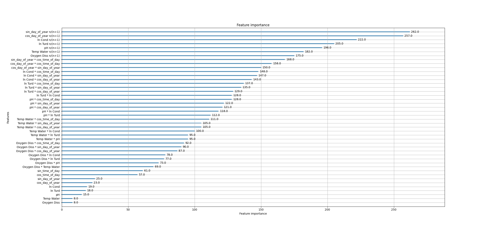

# AquaSense · Machine-Learning Module  
*Lightweight AI for Field-Deployable E. coli Estimation*

> **Core idea:** Estimate **E. coli concentration** using only five low-cost physicochemical indicators (O₂, temperature, pH, turbidity, conductivity) with a compact neural network (~18k parameters). The system eliminates the need for 18–24h lab incubation, enabling near-real-time microbial risk assessment in urban water systems.

---

## 1 · Task Definition

- **Input**: 44 proxy features (including statistical and trigonometric derivatives of 5 core indicators)
- **Output**: `ln Coliform` — natural logarithm of coliform counts (CFU per 100 mL)

---

## 2 · Model Architecture

| Layer | Output Dim | Details |
|-------|------------|---------|
| FC-1  | 128        | LeakyReLU(α=0.01) + Dropout(0.25) |
| FC-2  | 64         | LeakyReLU + Dropout(0.25) |
| FC-3  | 32         | LeakyReLU + Dropout(0.25) |
| Output | 1         | Linear activation |

- **Optimizer**: Adam (lr = 1e-4, weight_decay = 1e-4)  
- **Loss Function**: HuberLoss  
- **LR Scheduler**: StepLR (step = 100, γ = 0.9)  
- **Early Stopping**: patience = 50

> ⚙️ ~18k trainable parameters — compatible with Raspberry Pi, ESP-32 and other embedded platforms.

---

## 3 · Performance Comparison

| Method                   | RMSE ↓   | MAE ↓    | R² ↑     |
|--------------------------|----------|----------|----------|
| Turbidity-only LR        | 1.98     | 1.62     | 0.12     |
| Linear Regression        | 1.95     | 1.54     | 0.14     |
| Random Forest            | 1.74     | 1.34     | 0.32     |
| XGBoost                  | 1.79     | 1.37     | 0.28     |
| MLP-2L                   | 1.88     | 1.41     | 0.20     |
| **CNN-DropHuber (Ours)** | **0.82** | **0.72** | **0.37** |

Click to view Feature Importance (XGBoost)

---

## 4 · Output Files

| Path                                | Description                       |
|-------------------------------------|-----------------------------------|
| `model_best_val_loss.pth`   | Best model weights (lowest val RMSE) |
| `scaler.pkl`                        | StandardScaler object (used during training) |
| `baseline_results.csv`              | RMSE / MAE / R² of all baseline models |
| `3.1loss+R2_whole.png`                | Training & validation loss curve |
| `pred_true_scatter.png`             | Prediction vs. Ground Truth (scatter) |

---

## 5 · Contact

Project Lead: **John Wu**

Feel free to open an issue or submit a pull request on GitHub.
