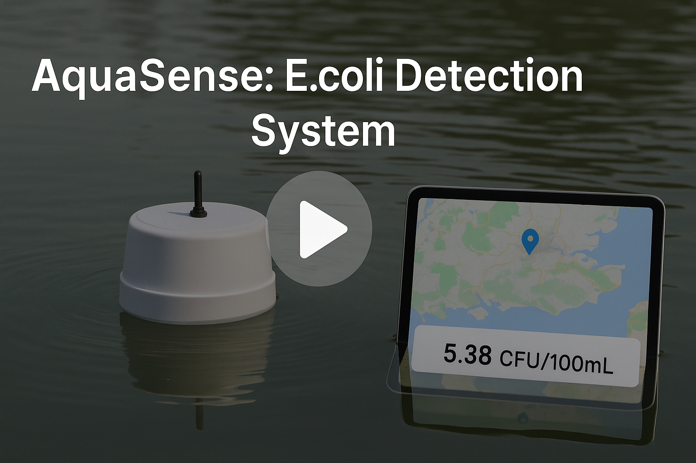

# Project Summary: Low-Cost AI-Based Water Quality Monitoring System

This project aims to develop a **low-cost, deployable monitoring system** for detecting **fecal contamination** (specifically *E. coli*) in surface waters by using **inorganic water quality parameters** (e.g., turbidity, DO, Temperature, pH, conductivity) as surrogate indicators, combined with a machine learning model.

We have built a **fully integrated system** including real-time data collection, wireless transmission, AI-based prediction, web/mobile visualization, and a hardware module for **automatic water sampling**.

---

## ✅ Key Features

- **Inorganic surrogate-based prediction** of E. coli levels using a neural network  
- **Low-power floating buoy** with Arduino + sensors + solar power + LoRa transmission  
- **Web and mobile dashboard** showing real-time and historical data  
- **Autonomous sampling unit** that collects water samples at scheduled intervals for future lab testing  
- **Preliminary model** trained on public data (log-scale RMSE ≈ 0.83)

## 🎥 Video preview

---

## 📦 System Components

1. **Hardware:**  
   - turbidity, DO, Temperature, pH, conductivity sensors  
   - Arduino + LoRa + solar-powered buoy  
   - Peristaltic pump + rotating bottle module (sampler)

2. **Software:**  
   - Arduino + LoRa + MQTT server + database  
   - Web dashboard & mobile app with map and data queries

3. **AI Module:**  
   - Fully connected neural network  
   - Training data from UK water quality datasets  
   - Predicts log-transformed E. coli concentration

---

## 🎯 Project Goals

- Demonstrate feasibility of **non-biological real-time E. coli estimation**  
- Build a **complete monitoring + sampling platform** for environmental deployment  
- Prepare for future lab-based E. coli validation and AI model refinement

---

## 🔄 Current Status

- ✅ Core sensing and data transmission system completed  
- ✅ Dashboard and app functional  
- ✅ AI model trained with promising performance  
- 🛠️ Autonomous sampler hardware under construction (expected to complete soon)

---

## Author
Zhuohang Wu 
zhuohang2024@163.com